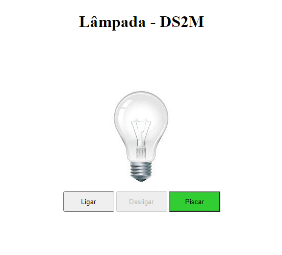

# Lâmpada - DS2M

<b>Projeto criado com o objetivo didático para as aulas de Programação Web Front-End (PWFE) do curso Desenvolvimento de Sistemas do [SENAI Jandira](https://jandira.sp.senai.br/), sobre orientação da [Bruna Lozinski](https://github.com/brunalozinski)<b>

<b>O projeto consiste em criar uma lâmpada que tenha quatro ações, ligar, desligar, quebrar e piscar, utilizando vários eventos.<b>

<b>O código foi constuído pensando em boas praticas, como responsabilidade única e funções puras.<b>

