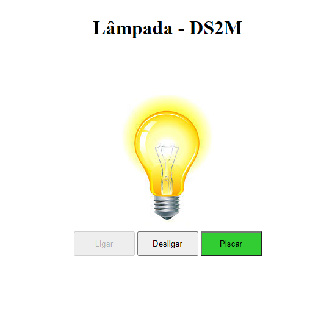

# Lâmpada - DS2M

projeto criado com o objetivo didático para as aulas de Programação Web Front-End (PWFE) do curso Desenvolvimento de Sistemas do [SENAI Jandira](https://jandira.sp.senai.br/), sobre orientação da [Bruna Lozinski](https://github.com/brunalozinski)

O projeto consiste em criar uma lâmpada que tenha três ações, ligar, desligar e quebrar, utilizando vários eventos.

O código foi constuído pensando em boas praticas, como responsabilidade única e funções puras.

